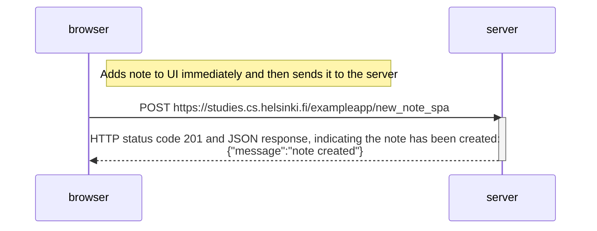

```mermaid
sequenceDiagram
    participant browser
    participant server

    Note right of browser: Adds note to UI immediately and then sends it to the server
    browser->>server: POST https://studies.cs.helsinki.fi/exampleapp/new_note_spa
    activate server
    server-->>browser: HTTP status code 201 and JSON response, indicating the note has been created: <br> {"message":"note created"}
    deactivate server
```